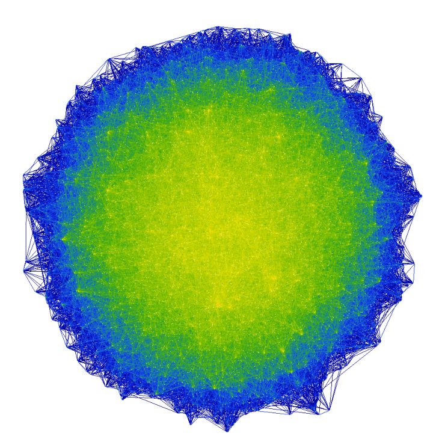

<!-- Improved compatibility of back to top link: See: https://github.com/othneildrew/Best-README-Template/pull/73 -->
<a name="readme-top"></a>
<!--
*** Thanks for checking out the Best-README-Template. If you have a suggestion
*** that would make this better, please fork the repo and create a pull request
*** or simply open an issue with the tag "enhancement".
*** Don't forget to give the project a star!
*** Thanks again! Now go create something AMAZING! :D
-->


<!-- PROJECT SHIELDS -->
<!--
*** I'm using markdown "reference style" links for readability.
*** Reference links are enclosed in brackets [ ] instead of parentheses ( ).
*** See the bottom of this document for the declaration of the reference variables
*** for contributors-url, forks-url, etc. This is an optional, concise syntax you may use.
*** https://www.markdownguide.org/basic-syntax/#reference-style-links
-->


<!-- PROJECT LOGO -->
<br />
<div align="center">
  <a href="https://deepufc.streamlit.app/">
    
  </a>

<h3 align="center">PaperGPT</h3>

  <p align="center">
    A smarter way to search and discover biomedical papers
    <br />
    <br />
    <a href="https://papergpt.streamlit.app/">View Demo</a>
    ·
    <a href="https://github.com/naity/PaperGPT/issues">Report Bug</a>
    ·
    <a href="https://github.com/naity/PaperGPT/issues">Request Feature</a>
  </p>
</div>


<!-- TABLE OF CONTENTS -->
<details>
  <summary>Table of Contents</summary>
  <ol>
    <li>
      <a href="#about-the-project">About The Project</a>
      <ul>
        <li><a href="#built-with">Built With</a></li>
      </ul>
    </li>
    <li>
      <a href="#getting-started">Getting Started</a>
      <ul>
        <li><a href="#prerequisites">Prerequisites</a></li>
      </ul>
    </li>
    <li><a href="#usage">Usage</a></li>
    <li><a href="#contributing">Contributing</a></li>
    <li><a href="#license">License</a></li>
    <li><a href="#contact">Contact</a></li>
  </ol>
</details>


<!-- ABOUT THE PROJECT -->
## About The Project

[![Paper Screen Shot][product-screenshot]](https://example.com)

PaperGPT is a cutting-edge Large Language Model (LLM)-based search and recommendation app designed for biomedical papers. Using advanced techniques, it transforms biomedical papers into vectors using [SentenceTransformers][SentenceTransformers-url] and builds an embedding database with [Chroma][Chroma-url]. This empowers users to discover papers that are most similar to their queries within the embedding space through an intuitive web app created with [Streamlit][Streamlit-url].


* 🔍 PaperGPT is an advanced LLM app for searching and recommending biomedical papers.
* 💡 Embed, store, and search biomedical papers as vectors.
* 🚀 Empowers users to effortlessly discover papers most similar to their queries through an intuitive web app.


<p align="right">(<a href="#readme-top">back to top</a>)</p>


### Built With

* [![Python][Python_badge]][Python-url]
* [![Streamlit][Streamlit_badge]][Streamlit-url]
* [![Chroma][Chroma_badge]][Chroma-url]
* [![SentenceTransformers][SentenceTransformers_badge]][SentenceTransformers-url]


<p align="right">(<a href="#readme-top">back to top</a>)</p>


<!-- GETTING STARTED -->
## Getting Started

To launch the PaperGPT web app, please follow the steps below:
1. Clone the repo:
```sh
git clone https://github.com/naity/PaperGPT.git
```

2. Run the Streamlit app:
```sh
streamlit run app.py
```

### Prerequisites

The following Python packages need to be installed in order to run the app. Please use the commands below for installation.
* Streamlit
  ```sh
  pip install streamlit
  ```
* Chroma
  ```sh
  pip install chromadb
  ```
* SentenceTransformers
  ```sh
  pip install  sentence-transformers
  ```

<p align="right">(<a href="#readme-top">back to top</a>)</p>


<!-- USAGE EXAMPLES -->
## Usage

The PaperGPT app can be run as is. However, users can also update or customize the embedding database for the app using the following Jupyter Notebooks:

1. **`pubmed.ipynb`**: This notebook searches biomedical research topics against [PubMed][PubMed-url]. You can modify the search terms to include or exclude topics based on your research interest. Additionally, you can also change the number of papers to return for each topic.

2. **`build_index.ipynb`**: Run this notebook after executing `pubmed.ipynb` to transform the collected papers into vectors and build the embedding database for the PaperGPT app. You may customize the underlying LLM for creating embeddings.

<p align="right">(<a href="#readme-top">back to top</a>)</p>


<!-- CONTRIBUTING -->
## Contributing

Contributions are what make the open source community such an amazing place to learn, inspire, and create. Any contributions you make are **greatly appreciated**.

If you have a suggestion that would make this better, please fork the repo and create a pull request. You can also simply open an issue with the tag "enhancement".
Don't forget to give the project a star! Thanks again!

1. Fork the Project
2. Create your Feature Branch (`git checkout -b feature/AmazingFeature`)
3. Commit your Changes (`git commit -m 'Add some AmazingFeature'`)
4. Push to the Branch (`git push origin feature/AmazingFeature`)
5. Open a Pull Request

<p align="right">(<a href="#readme-top">back to top</a>)</p>


<!-- LICENSE -->
## License

Distributed under the MIT License. See `LICENSE.txt` for more information.

<p align="right">(<a href="#readme-top">back to top</a>)</p>


<!-- CONTACT -->
## Contact

<p align="left">
<a href="https://linkedin.com/in/ytiancompbio" target="blank"></a>
<a href="https://twitter.com/ytiancompbio" target="blank"></a>
<a href="https://medium.com/@yuan_tian" target="blank"></a>
<a href="https://www.youtube.com/c/ytiancompbio" target="blank"></a>
</p>

<p align="right">(<a href="#readme-top">back to top</a>)</p>


<!-- MARKDOWN LINKS & IMAGES -->
<!-- https://www.markdownguide.org/basic-syntax/#reference-style-links -->
[product-screenshot]: images/screenshot.gif
[Python_badge]: https://img.shields.io/badge/python-3670A0?style=for-the-badge&logo=python&logoColor=ffdd54
[Python-url]: https://www.python.org/
[Streamlit_badge]: https://img.shields.io/badge/Streamlit-20232A?style=for-the-badge&logo=Streamlit
[Streamlit-url]: https://streamlit.io/
[Chroma_badge]: https://img.shields.io/badge/Chroma-563D7C?style=for-the-badge
[Chroma-url]: https://www.trychroma.com/
[SentenceTransformers_badge]: https://img.shields.io/badge/SentenceTransformers-blue?style=for-the-badge
[SentenceTransformers-url]: https://www.sbert.net/
[PubMed-url]: https://pubmed.ncbi.nlm.nih.gov/
